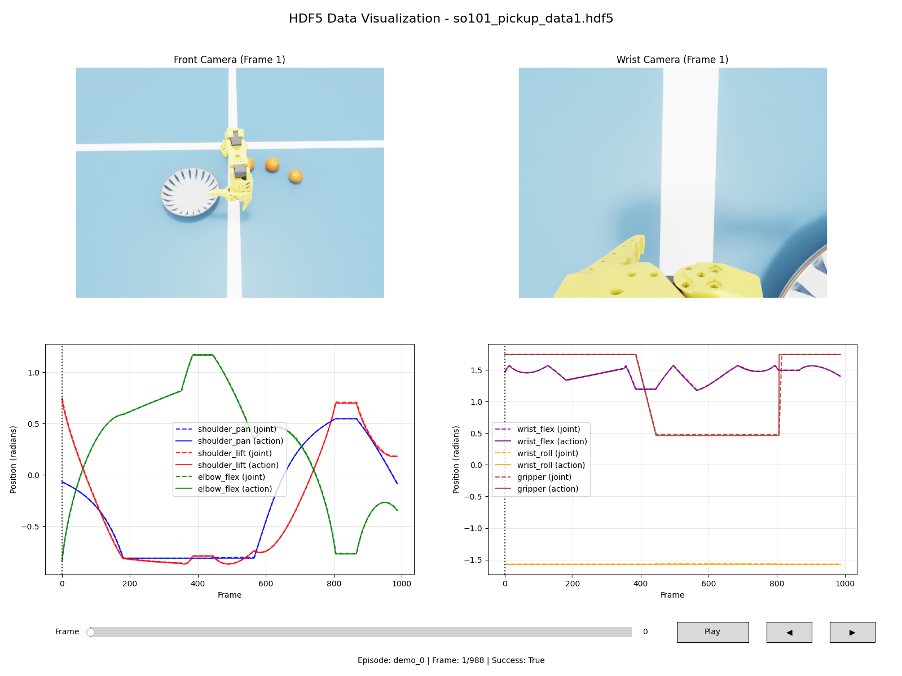
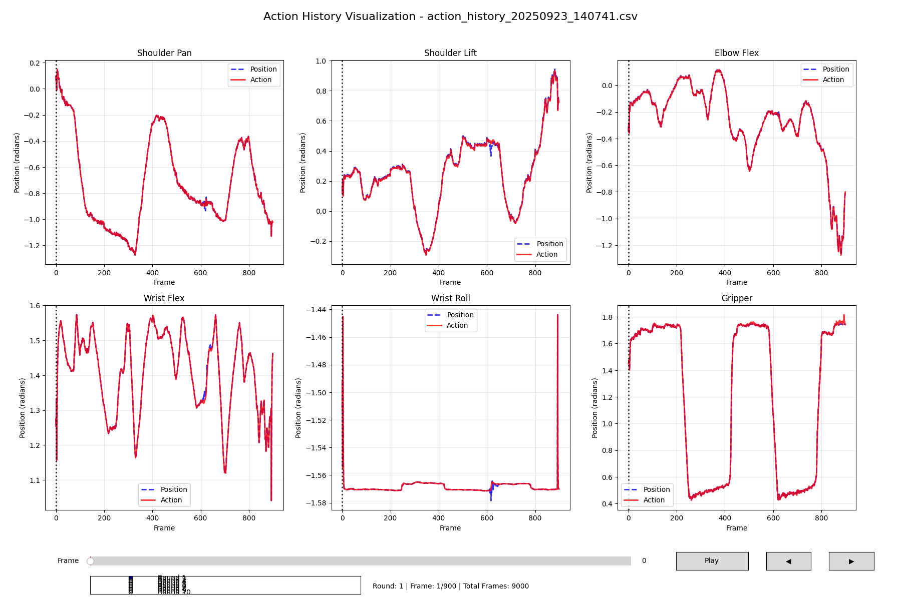

[English](README.md) | [简体中文](README_zh.md)

---

# so101-autogen

> **Zero Teleop, Infinite Data: The Automated Synthetic Data Framework for Robotics.**


---

**so101-autogen** is an open-source framework designed for the rapid, large-scale generation of synthetic robotic manipulation datasets, completely automatically. By cleverly combining IK-based control with a simple state machine, this project eliminates the need for manual teleoperation, drastically reducing the time and effort required to collect high-quality data for training visuomotor policies.

This initial version demonstrates a proof-of-concept for a pick-and-place task (picking oranges and placing them in a plate) within Isaac Sim. It showcases the core capability of the framework: generating hundreds of successful grasp episodes in a fully automated fashion.

My vision is to evolve this tool into an industrial-grade synthetic data generation pipeline. Future developments will focus on abstracting the framework to allow users to define new scenes, objects, and tasks through simple configuration files, integrating domain adaptation techniques, and migrating to Isaac Lab for a more streamlined experience.

## ✨ Key Features

-   **🚀 Fully Automatic**: No human intervention needed. Just run a script and watch the data being generated.
-   **⚡️ High-Efficiency Conversion**: A multi-process script converts the generated HDF5 data into the LeRobot format in minutes.
-   **🔧 Easily Configurable**: Scene parameters, object properties, and robot behaviors can be adjusted in a single YAML file.
-   **🔬 Visualization Tools**: Includes scripts to visualize the collected HDF5 data and the action history of inference rollouts.
-   **🤖 End-to-End Workflow**: Provides a complete pipeline from **data generation** and **conversion** to **policy training** and **inference** examples.

## 🏗️ Project Structure

The project is organized into several key directories:

```
.
├── assets/         # 3D asset files (must be downloaded separately)
├── config/         # Configuration files
│   └── scene_config.yaml
├── demo/           # Demo images and videos
├── scripts/        # Core executable scripts
│   ├── data_collection_automatic.py  # Automated data collection
│   ├── parallel_converter.py         # Parallelized data converter
│   ├── hdf5_visualizer.py            # HDF5 data visualizer
│   ├── vla_inference.py              # VLA policy inference
│   └── action_history_visualizer.py  # Action history visualizer
├── src/            # Source code
│   ├── core/         # Core simulation logic
│   ├── robot/        # Robot controllers (IK, Gripper)
│   ├── scene/        # Scene management
│   ├── state_machine/# State machine for automated tasks
│   └── vla/          # VLA policy client and helpers
└── requirements.txt  # Python dependencies
```

## 🛠️ Installation

This project is built upon **Isaac Sim 4.5.0 and is also compatible with newer versions like 5.0.0**. Please follow these steps carefully.

**1. Set up Conda Environment & Isaac Sim**

First, ensure you have a working Conda installation. Then, set up the `isaac` environment by following the official IsaacLab installation guide as a reference, which provides a compatible setup. The core dependencies are Python 3.10 and CUDA 11.8.

```bash
# 1. Create and activate the conda environment
conda create -n isaac python=3.10
conda activate isaac

# 2. Install PyTorch (ensure compatibility with your CUDA version)
pip install torch==2.7.0+cu128 torchvision==0.22.0+cu128 --index-url https://download.pytorch.org/whl/cu128

# 3. Install Isaac Sim
pip install --upgrade pip
pip install 'isaacsim[all,extscache]==4.5.0' --extra-index-url https://pypi.nvidia.com
```

**2. Install LeRobot and FFmpeg (Prerequisite)**

Before installing this project's dependencies, you must install `LeRobot` from its source repository as it is a core component. It is also crucial to install a specific version of FFmpeg via Conda. You can clone the `lerobot` repository in any suitable location outside of this project's directory.

```bash
# First, install FFmpeg from conda-forge
conda install ffmpeg=7.1.1 -c conda-forge

# Then, clone and install LeRobot in a suitable directory
git clone https://github.com/huggingface/lerobot.git
pip install -e /path/to/your/lerobot
```

**3. Clone This Repository**

```bash
git clone https://github.com/haoran1062/so101-autogen.git
cd so101-autogen
```

**4. Install Dependencies**

Install the remaining Python packages using the provided `requirements.txt` file.

```bash
pip install -r requirements.txt
```

**5. Download Assets**

The 3D assets for the robot and scene objects are provided separately. Download them from the link below and extract the contents into the project's root directory. After extraction, you should have an `assets` folder at the root of the project.

-   **Download Link**: [Google Drive](https://drive.google.com/file/d/1y09df3kQFLU5BTBNyNZQmaFTPyv8i3jJ/view?usp=sharing)

## 🚀 Quick Start: A Complete Workflow

This section guides you through the entire process, from generating data to running inference with a trained model.

**Step 1: Automated Data Collection**

Run the automatic data collection script. The following command will generate a dataset with 180 successful pick-and-place episodes.

```bash
python scripts/data_collection_automatic.py --total-success-episodes 180 --data-output ./datasets/auto_v1_180.hdf5
```

**Step 2 (Optional): Visualize Collected Data**

You can inspect the generated HDF5 dataset using the visualizer script.

```bash
python scripts/hdf5_visualizer.py --hdf5_file ./datasets/auto_v1_180.hdf5
```
This will show you the camera views and state information from the collected data.



**Step 3: Convert Data to LeRobot Format**

Convert the HDF5 file into a format ready for training with LeRobot. This script is parallelized to be highly efficient.

```bash
# Make sure to replace the repo-id and python-executable path
python scripts/parallel_converter.py \
    --hdf5-root ./datasets \
    --hdf5-files auto_v1_180.hdf5 \
    --repo-id your-hf-username/pickup_orange_180e \
    --num-workers 24 \
    --python-executable /path/to/your/miniconda3/envs/isaac/bin/python
```
_Note: Adjust `--num-workers` based on your CPU cores and provide the correct path to your conda environment's python executable._

Here are examples of the camera data generated:
| Front Camera | Wrist Camera |
|---|---|
|  |  |


**Step 4: Train a Policy (with LeRobot)**

After your dataset is converted (and optionally uploaded to the Hugging Face Hub, the default option to push the dataset to HF is off, if you need to bring the parameters), you can now train a policy. Here is an example command using the official LeRobot tools.

```bash
# This command should be run in your LeRobot training environment
lerobot-train \
    --batch_size=64 \
    --steps=30000 \
    --dataset.repo_id=your-hf-username/pickup_orange_180e \
    --policy.device=cuda \
    --wandb.enable=true \
    --policy.path=../weights/smolvla_base \
    --save_freq=2000 \
    --job_name=smolvla_180e_30k
```

**Step 5: Run Inference in Isaac Sim**

Once you have a trained model checkpoint, you can run inference directly in our Isaac Sim environment.

First, launch the LeRobot policy server (in your LeRobot environment):
```bash
python /path/to/your/lerobot_project/src/lerobot/scripts/server/policy_server.py --host=127.0.0.1 --port=4399
```

Next, run the inference client script in this project's environment:
```bash
# Update the checkpoint path to your trained model
python scripts/vla_inference.py \
    --policy_checkpoint_path=/path/to/your/weights/checkpoints/last/pretrained_model \
    --step_hz=60 \
    --episode_length_s=30 \
    --policy_action_horizon=50 \
    --eval_rounds=10
```
This will run the policy in the simulation for 10 evaluation rounds.

**Step 6 (Optional): Visualize Action History**

The inference script records the joint action history to a CSV file. You can visualize this data to analyze the policy's behavior.

```bash
# The script automatically finds the latest csv file if --csv_file is not provided
python scripts/action_history_visualizer.py
```



##  Roadmap

-   [ ] **Framework Abstraction**: Generalize the data generation pipeline to support custom scenes and objects via configuration.
-   [ ] **Advanced Data Augmentation**: Integrate domain randomization and other sim-to-real techniques.
-   [ ] **Isaac Lab Migration**: Transition the project to Isaac Lab for more robust and simplified environment creation.
-   [ ] **More Examples**: Provide more examples for different robots and tasks.

## 🙏 Acknowledgements

This project was made possible by the incredible work of the teams behind **[LeRobot](https://github.com/huggingface/lerobot)** and **[LeIsaac](https://github.com/LightwheelAI/leisaac)**. Our framework is heavily inspired by their design principles and incorporates modified code from their repositories. We are especially grateful to the `LeIsaac` project for providing the high-quality USD assets (oranges and plate) used in our example scene.

## 📜 Disclaimer

This project is intended for research and educational purposes only. It is not affiliated with any commercial entity and should not be used for commercial purposes.

## 📫 Contact

- **Author**: Haoran Liu
- **Email**: `haoranliu1062@gmail.com`
- **GitHub**: [https://github.com/lihaoran1062](https://github.com/lihaoran1062)

## Contribution and Community

We welcome contributions of all forms! If you find this project useful, please consider giving it a star ⭐. We also welcome you to submit issues or pull requests to improve the project together. Hope this project can be useful to you!