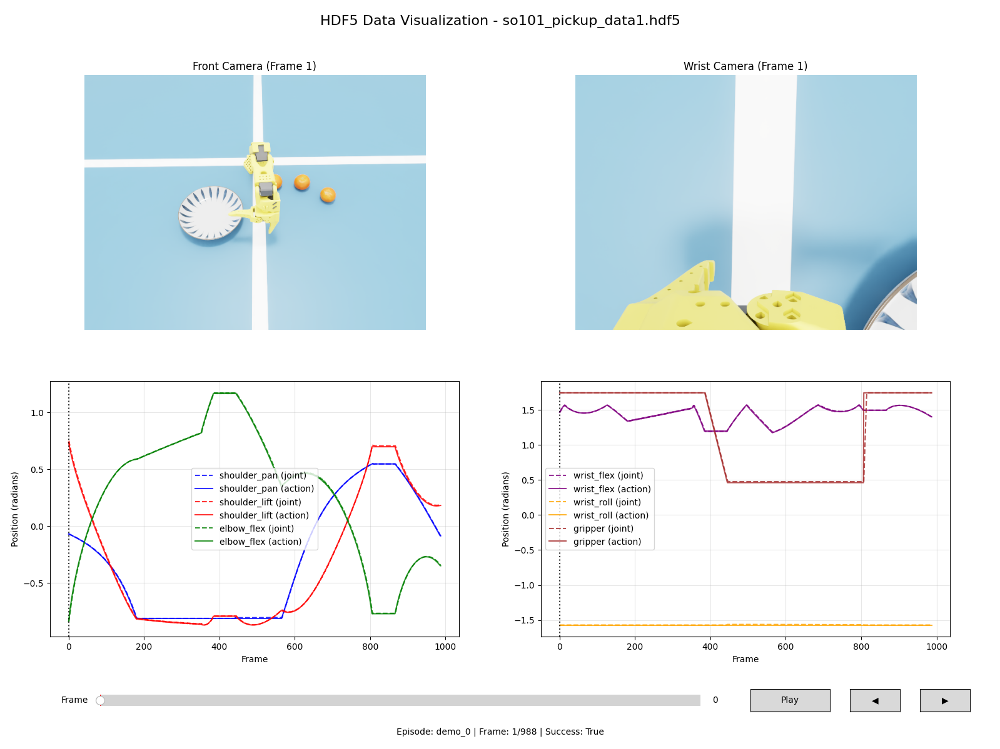

[English](README.md) | [简体中文](README_zh.md)

---

# so101-autogen

> **零遥操，一键生成：您的自动化机器人数据集引擎。**


---

**so101-autogen** 是一个开源框架，旨在完全自动地、快速、大规模地生成用于机器人操作的合成数据集。通过巧妙地结合基于IK的控制和简单的状态机，本项目消除了手动遥操作的需求，极大地减少了为训练视觉-动作策略而收集高质量数据所需的时间和精力。

此初始版本在 Isaac Sim 中展示了一个抓取与放置任务（拾取橙子并将其放入盘子）的概念验证。它展示了该框架的核心能力：以完全自动化的方式生成数百个成功的抓取片段。

我的愿景是将此工具发展成为一个工业级的合成数据生成流水线。未来的开发将专注于抽象化框架，允许用户通过简单的配置文件定义新的场景、对象和任务，集成领域自适应技术，并迁移到 Isaac Lab 以获得更流畅的体验。

## ✨ 核心特性

-   **🚀 完全自动**: 无需人工干预。只需运行一个脚本，即可观察数据生成过程。
-   **⚡️ 高效转换**: 多进程脚本可在数分钟内将生成的 HDF5 数据转换为 LeRobot 格式。
-   **🔧 易于配置**: 场景参数、对象属性和机器人行为都可以在一个 YAML 文件中进行调整。
-   **🔬 可视化工具**: 包含用于可视化收集的 HDF5 数据和推理部署动作历史的脚本。
-   **🤖 端到端工作流**: 提供从数据生成、转换到策略训练和推理示例的完整流程。

## 🏗️ 项目结构

项目组织结构如下：

```
.
├── assets/         # 3D 资源文件 (必须单独下载)
├── config/         # 配置文件
│   └── scene_config.yaml
├── demo/           # 示例图片和视频
├── scripts/        # 核心可执行脚本
│   ├── data_collection_automatic.py  # 自动化数据收集
│   ├── parallel_converter.py         # 并行化数据转换器
│   ├── hdf5_visualizer.py            # HDF5 数据可视化工具
│   ├── vla_inference.py              # VLA 策略推理
│   └── action_history_visualizer.py  # 动作历史可视化工具
├── src/            # 源代码
│   ├── core/         # 核心仿真逻辑
│   ├── robot/        # 机器人控制器 (IK, 夹爪)
│   ├── scene/        # 场景管理
│   ├── state_machine/# 用于自动化任务的状态机
│   └── vla/          # VLA 策略客户端及辅助工具
└── requirements.txt  # Python 依赖
```

## 🛠️ 安装

本项目基于 **Isaac Sim 4.5.0 构建，同时兼容 5.0.0 等更高版本**。请仔细遵循以下步骤。

**1. 设置 Conda 环境和 Isaac Sim**

首先，请确保您已安装 Conda。然后，参照官方 IsaacLab 安装指南来设置 `isaac` 环境，该指南提供了一个兼容的设置。核心依赖项为 Python 3.10 和 CUDA 11.8。

```bash
# 1. 创建并激活 conda 环境
conda create -n isaac python=3.10
conda activate isaac

# 2. 安装 PyTorch (确保与您的 CUDA 版本兼容)
pip install torch==2.7.0+cu128 torchvision==0.22.0+cu128 --index-url https://download.pytorch.org/whl/cu128

# 3. 安装 Isaac Sim
pip install --upgrade pip
pip install 'isaacsim[all,extscache]==4.5.0' --extra-index-url https://pypi.nvidia.com
```

**2. 安装 LeRobot 和 FFmpeg (前置条件)**

在安装本项目依赖之前，您必须从源代码仓库安装 `LeRobot`，因为它是核心组件之一。同时，通过 Conda 安装特定版本的 FFmpeg 也至关重要。您可以在本项目目录之外的任何合适位置克隆 `lerobot` 仓库。

```bash
# 首先，从 conda-forge 安装 FFmpeg
conda install ffmpeg=7.1.1 -c conda-forge

# 接着，在合适的位置克隆并安装 LeRobot
git clone https://github.com/huggingface/lerobot.git
pip install -e /path/to/your/lerobot
```

**3. 克隆本仓库**

```bash
git clone https://github.com/haoran1062/so101-autogen.git
cd so101-autogen
```

**4. 安装依赖**

使用提供的 `requirements.txt` 文件安装其余的 Python 包。

```bash
pip install -r requirements.txt
```

**5. 下载资源文件**

机器人和场景对象的 3D 资源需单独提供。请从以下链接下载，并将其内容解压到项目的根目录。解压后，您的项目根目录下应出现一个 `assets` 文件夹。

-   **下载链接**: [Google Drive](https://drive.google.com/file/d/1y09df3kQFLU5BTBNyNZQmaFTPyv8i3jJ/view?usp=sharing)

## 🚀 快速开始: 完整工作流

本节将引导您完成从生成数据到使用训练好的模型进行推理的全过程。

**步骤 1: 自动化数据收集**

运行自动化数据收集脚本。以下命令将生成一个包含180个成功的抓取与放置片段的数据集。

```bash
python scripts/data_collection_automatic.py --total-success-episodes 180 --data-output ./datasets/auto_v1_180.hdf5
```

**步骤 2 (可选): 可视化收集的数据**

您可以使用可视化脚本检查生成的 HDF5 数据集。

```bash
python scripts/hdf5_visualizer.py --hdf5_file ./datasets/auto_v1_180.hdf5
```
这将显示收集数据中的摄像头视图和状态信息。



**步骤 3: 将数据转换为 LeRobot 格式**

将 HDF5 文件转换为适用于 LeRobot 训练的格式。此脚本经过并行化处理，效率很高。

```bash
# 请确保替换 repo-id 和 python-executable 路径
python scripts/parallel_converter.py \
    --hdf5-root ./datasets \
    --hdf5-files auto_v1_180.hdf5 \
    --repo-id your-hf-username/pickup_orange_180e \
    --num-workers 24 \
    --python-executable /path/to/your/miniconda3/envs/isaac/bin/python
```
*注意: 请根据您的 CPU 核心数调整 `--num-workers`，并提供正确的 conda 环境 python 可执行文件路径。*

以下是生成的摄像头数据示例：
| 前置摄像头 | 手腕摄像头 |
|---|---|
|  |  |


**步骤 4: 训练策略 (使用 LeRobot)**

在您的数据集转换完成并可能上传到 Hugging Face Hub 后，您现在可以训练一个策略。以下是使用 LeRobot 官方工具的示例命令。

```bash
# 此命令应在您的 LeRobot 训练环境中运行
lerobot-train \
    --batch_size=64 \
    --steps=30000 \
    --dataset.repo_id=your-hf-username/pickup_orange_180e \
    --policy.device=cuda \
    --wandb.enable=true \
    --policy.path=../weights/smolvla_base \
    --save_freq=2000 \
    --job_name=smolvla_180e_30k
```

**步骤 5: 在 Isaac Sim 中运行推理**

一旦您有了训练好的模型检查点，就可以直接在我们的 Isaac Sim 环境中运行推理。

首先，启动 LeRobot 策略服务器 (在您的 LeRobot 环境中):
```bash
python /path/to/your/lerobot_project/src/lerobot/scripts/server/policy_server.py --host=127.0.0.1 --port=4399
```

接下来，在此项目的环境中运行推理客户端脚本:
```bash
# 将检查点路径更新为您训练好的模型
python scripts/vla_inference.py \
    --policy_checkpoint_path=/path/to/your/weights/checkpoints/last/pretrained_model \
    --step_hz=60 \
    --episode_length_s=30 \
    --policy_action_horizon=50 \
    --eval_rounds=10
```
这将在仿真中运行策略10个评估回合。

**步骤 6 (可选): 可视化动作历史**

推理脚本会将关节动作历史记录到 CSV 文件中。您可以可视化此数据以分析策略的行为。

```bash
# 如果未提供 --csv_file，脚本会自动查找最新的csv文件
python scripts/action_history_visualizer.py
```


## 路线图

-   [ ] **框架抽象化**: 将数据生成流程泛化，以支持通过配置自定义场景和对象。
-   [ ] **高级数据增强**: 集成域随机化和其他 sim-to-real 技术。
-   [ ] **迁移至 Isaac Lab**: 将项目迁移到 Isaac Lab，以实现更健壮和简化的环境创建。
-   [ ] **更多示例**: 提供更多针对不同机器人和任务的示例。

## 🙏 致谢

本项目的实现得益于 **[LeRobot](https://github.com/huggingface/lerobot)** 和 **[LeIsaac](https://github.com/LightwheelAI/leisaac)** 团队的杰出工作。我们的框架深受其设计理念的启发，并整合了其仓库中的部分修改代码。我们特别感谢 `LeIsaac` 项目为我们的示例场景提供了高质量的 USD 资源（橙子和盘子）。

## 📜 免责声明

本项目仅用于研究和教育目的，不隶属于任何商业实体，不应用于商业用途。

## 📫 联系方式

- **作者**: Haoran Liu
- **邮箱**: `haoranliu1062@gmail.com`
- **GitHub**: [https://github.com/lihaoran1062](https://github.com/lihaoran1062)

## 贡献与交流

我们欢迎各种形式的贡献！如果您觉得这个项目对您有用，请不吝点亮一颗星 ⭐。同时，也欢迎您提交 Issue 或 Pull Request，共同改进这个项目。希望这个项目可以对你有用！
